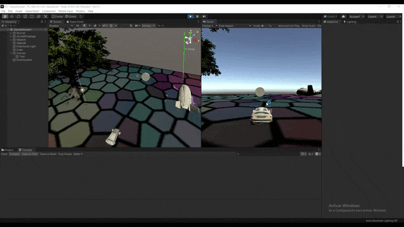

# ll_pr3

## Cuando el jugador colisiona con un objeto de tipo B, el objeto A mostrará un texto en una UI de Unity. Cuando toca el objeto A se incrementará la fuerza del objeto B

Primeramente, se ha creado un controlador en el script del jugador. Este manejara las colisiones del jugador con los demas objetos e invocará los eventos correspondientes.

<pre><code>

void OnCollisionEnter(Collision col) {
        if (col.gameObject.tag == "ObjA") 
			OnContactB();
        if (col.gameObject.tag == "ObjB") 
			OnContactA();
    }

</code></pre>

Para que se pueda acceder al controlador desde cualquier otro script, se usa el patrón singleton.

Una vez hecho lo anterior, se crea un script para cada objeto, y se enlazan los eventos correspondientes con los métodos, para que por ejemplo cuando se active el evento onContactA, se ejecute el método mostrarTexto en el objeto A.

<pre><code>

void Start()
    {
        charController.Instance.OnContactA += mostrarTexto;
    }

</code></pre>

mostrarTexto() activa el componente text de un objeto Text y lo desactiva a los 3 segundos usando un metodo IEnumerator
<pre><code>

private void mostrarTexto() {
        texto.enabled = true;

        StartCoroutine(quitarMensaje());

    }

    private IEnumerator quitarMensaje() {
        yield return new WaitForSeconds(3);
        texto.enabled = false;
    }

</code></pre>

En el objeto B se aumentará un float que simboliza la fuerza.

El objeto A es el árbol y el B es la moneda.

 

## Cuando el jugador se aproxima a los cilindros de tipo A, los cilindros de tipo B cambian su color y las esferas se orientan hacia un objetivo ubicado en la escena con ese propósito

Se ha asignado una nave espacial como el objeto que cambia su orentacion. Este objeto cambiará su orientacion al jugador cuando este se acerque al objeto A. Se usa un collider con el atributo isTrigger activado para detectar cuando el jugador esta cerca. Cuando esto pase, se activará el evento acercadoA. A partir de esto, el objeto B ejecutará cambiarColor() y la nave ejecutará mirarAObjeto()

En cambiar color, se le asigna un color aleatorio al color del material. Esto se consigue creando un color cuyas componentes RGB sean un numero aleatorio del 0 al 1.

<pre><code>

private void cambiarColor() {
        Debug.Log("cambio");
        gameObject.GetComponent<Renderer>().material.color = new Color(Random.Range(0f, 1f),Random.Range(0f, 1f),Random.Range(0f, 1f));
    }

</code></pre>

Para que la nave espacial mire hacia el jugador, se usa el metodo LookAt, al que se le pasa el componente Transform del jugador.

<pre><code>

private void mirarAObjeto() {
        transform.LookAt(charController.Instance.gameObject.transform);
    }

</code></pre>

 

## Implementar un controlador que mueva el objeto con wasd

Se usa el mismo codigo que en la practica anterior para hacer esto.

## Buscar información de Debug.DrawRay y utilízala para depuración.

Se calcula la direccion en la que esta mirando la nave espacial y después se dibuja usando el método Debug.DrawRay

<pre><code>

Vector3 forward = transform.TransformDirection(Vector3.forward) * 100;
        Debug.DrawRay(transform.position, forward, Color.green);

</code></pre>

